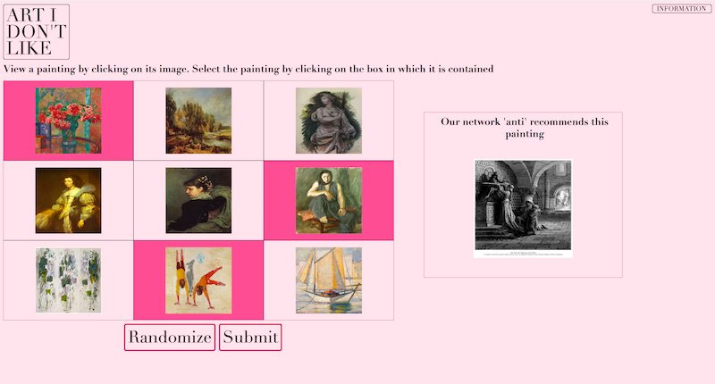
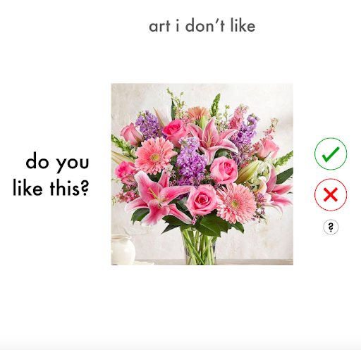
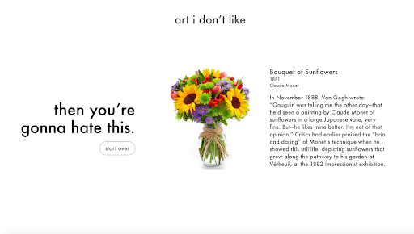
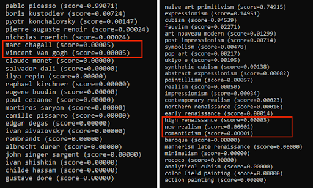
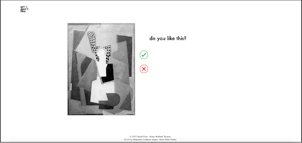
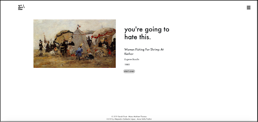

# What is Art I Don't Like?

I began Art I Don’t Like as part of a graduate class at UC Santa Cruz in Fall 2018. I had recently learned about filter bubbles and personalization algorithms, and was worried about increasing polarization between people with different political affiliations. I thought that by introducing people to different types of art I could help encourage conversations about different opinions and beliefs, which would later be extrapolated to political opinions.

After finishing the initial development of Art I Don’t Like in Winter 2019 with Manu Mathew Thomas, I presented the system as a [demonstration](https://mw19.mwconf.org/paper/art-i-dont-like-an-anti-recommender-system-for-visual-art/) at Museums and the Web in April 2019 in Boston. I received valuable feedback from art communities about the educational benefit of this project [1]. After speaking with curators, artists, and museum technologists, I learned that many people do not understand the underlying technology of recommender systems [1]. This system created an opportunity to help users understand how their image choices impact the recommended image. The system can also help users develop an understanding about what qualities of visual art they like and dislike. This website is an interactive art experience that provides personalized content to users. Art I Don’t Like suggests content by prompting users to pick artworks that they find visually appealing. This project gives users a digital space to view and interact with art that they have not specifically searched for and probably would not search for.

Recommender systems are usually classified into three types: content-based, collaborative, and hybrid [2]. Content-based recommender systems show the user items similar to the ones the user rated highly in the past [3]. For example, a movie recommender system classifies movies based on genre, actors, general rating, and other characteristics. It then looks for other movies with classifications similar to movies the user has viewed and rated highly in the past. Over time, content-based systems learn about user taste and preferences either implicitly or explicitly [4]. Collaborative recommender systems show the user items that people with similar tastes and preferences have liked in the past. Amazon's system for recommending books is an example of a collaborative recommender system [2]. Finally, hybrid systems utilize a mix of both content-based and collaborative system technology [4]. Hybrid systems can combine content-based and collaborative recommender systems in several ways. An issue with all recommender systems is the potential lack of transparency for users. The way in which recommender systems connect similar items or similar users can be unclear to users. Users might not be aware that Facebook is presenting different information to them based on personalization algorithms [5].
The original landing page of the website shows nine pieces of art from our dataset. In this grid, the pieces have been resized for continuity, but the user can click on each piece to see the original size.

Figure 1: The original website design
After creating the initial website, we presented the site to graduate students in the Computational Media Department at University of California, Santa Cruz and asked them a few questions. We received eight responses to the open-ended questions which included “How would you use this website?” and “What are your initial thoughts about the website?”
We received these comments:

> I like the idea of a art website that exposes me to art that I might not normally encounter, because I wouldn’t seek it out/identify with similar things.

> The idea itself is cool, but it’s also valuable to notice that the system itself forces the user to become aware of “echo chambers” in their own interactions. The information page is very useful in that sense. I would hope that general users would take the time to read through it and not just stay on the anti-recommender page.

> I like it! I would have my friends do it too and see what they get. It could generate discussions between us.

> I think having more options to choose from would be good. I’m not sure if the current sample size is enough to determine my taste in art.

We received many pieces of positive feedback, but users were also confused about how to select pieces of art, and the purpose of the “Randomize” button. When speaking with Marvin Yang in January 2020, he mentioned that he found the nine images on the main page to be overwhelming. He said he would ignore the third row of images, and only focus on the top six.

With all this in mind, I decided that my goals for this quarter were to create and implement a new website design that showed the user one piece of art at a time. This design would also be streamlined and clean. After implementing this new design, I wanted to get feedback from users and learn about the emotional affect of the website. First I created Adobe XD wireframes with the help of Alejandro Calderon Lopez and Anna Sofia Frattini, two visiting students in the Creative Coding lab. I then modified my code to implement the new design on my local machine. After several iterations of the design, I finished programming and moved to develop the user test with the help of Aurora Alparaz, a Cognitive Science undergraduate working in the Creative Coding lab. We then conducted the user tests and analyzed our findings.

## Website Redesign

Our Adobe XD wireframes had an aesthetically pleasing, neutral design. The user would be presented with five images to like or dislike and then be presented with the result image. We built the wireframes with images of flowers, so that we could imagine the updated design with the images of art.

Figure 2: Two screen captures of the Adobe XD wireframes.

To implement the new design, I had to move the code from an AWS EC2 instance to my laptop. The first step was to create a smaller dataset. Our initial dataset consisted of 52,000 paintings from WikiArt. This dataset was extracted by Tan, et al. [6] and categorized by artist and genre - 23 artists and 27 art genres are represented. Our mini dataset consisted of 300 images, representing the 23 artists and 27 genres. Our new algorithm for choosing art allows the user to choose the amount of art they like, with a minimum of three paintings. We decided not to cap the amount of pieces of art that a user could look at before clicking the “Find Art” button.

Figure 3: Our classifiers give a confidence score for the input painting with regard to the artists and genres.

The new design also includes information for the result piece of art. The images from the WikiArt dataset were named with the artist, name of the work, and sometimes, date of completion. For example, Edgar Degas’s 1877 work, Women on a Cafe Terrace in the Evening, has this image name: edgar-degas_women-on-a-cafe-terrace-in-the-evening-1877.jpg. Using JavaScript and regular expressions, we isolated the pieces of information and displayed them for the user to see. The site is not yet accessible on the web, but is running on my local machine.

Figure 4: The redesigned website.
## User Testing
I wanted to develop a study to gauge user emotion. I wanted to know if this updated design would increase feelings of curiosity in users. I decided to use the PANAS scale, but made two adjustments. I included a “0” rating of a feeling or emotion to denote “Not at all”, and changed “1” to denote “Very slightly” instead of “Very slightly or not at all” [7]. I added curious as a feeling, but chose to report changes in feelings of curiosity separately, and not include the amount in the general positive and negative affect.
I conducted the user tests with Aurora Alparaz, a Cognitive Science undergraduate working in the Creative Coding lab. We ran the study with six users who were graduate students or Post-Docs researchers in the Computational Media Department, who had heard little or nothing about this project. Because I had collected the names of the students who completed the questionnaire for the original design, I made sure that those users were not included in this study.

 We began each user test with a brief overview of the project. To control for users’ state of minds before looking at the system, we conducted a pre-use PANAS test. After approximately five minutes of use, we stopped each user and conducted a post-use PANAS test. Finally, we asked the user to fill out a survey with several open ended questions. The time instruction with both the pre-use and post-use PANAS tests was “Today: You have felt this way today” [7]. Some general observations we had across the users were that they liked the simple, clean design, they did not look at the information section of the website, and finally, that they chose to like or dislike many pieces of art before clicking “Find Art” and seeing the resulting image. Although we did not track specifically how many pieces of art each user looked at before requesting a result, it was many more than the nine images presented to the user in the original design. In the survey we asked the users, “How many pieces of art should a user like before being presented with a disliked piece of art?” The answers we received were:

> “Probably dozens, maybe hundreds”

> “All of them”

> “Depending on the system...the number should increase as more factors are considered”

> “50”

> “At least 15”

> “5 minimum”

This was surprising to me, because I assumed that users would not want to spend a significant amount of time evaluating pieces of art. If I were to do a follow up study, I would track how long users spend looking at each piece of art, and use that to make decisions about the optimal length of the experience. We also asked users to tell us how likely they were to recommend Art I Don’t Like to a friend. On a scale of 1 to 7, with 1 denoting “not at all”, and 7 denoting “very much so” the mean was 2.5. This is lower than I was hoping, and has made me think about redesigning the project again - and considering alternative modes of experience.
In terms of the positive and negative affect change between the pre- and post-use tests, there was an average decrease of 2.5 points over all 10 positive feelings/emotions, and an average decrease of 4.83 points over all 10 negative feelings/emotions. There was an average increase of .5 points for “curious”. I believe the positive and negative affect change could be related to the stressful events taking place as we conducted the user studies. Although I would have liked to conduct the study with more participants, given the events of the quarter, we did not have enough time to conduct more.

## Future work

A design change that I initially hoped to do this quarter was implement functionality to allow users to comment on pieces of art, and see comments from other users. This would allow me to aggregate user opinions about the pieces of art, to develop the recommender system as a collaborative or content/collaborative hybrid system. I could use information from users to predict what other users would like. The simplest version of this would be creating buttons that appear when the result piece of art is shown: “I did hate this” and “I didn’t hate this”.
Because users chose many pieces of art before clicking “Find Art”, the algorithm speed was reduced. The system categorizes all of the pieces of art the user chooses, and several times the user had to wait several seconds before the result image loaded. I plan to implement a loading icon to provide more information to users and help them understand that the process is underway.
I also plan to make the font larger on the website, to make it easier for users to read if they have vision impairment. To that end, I would like to think about ways to make the website more accessible to users who have vision impairment. This would include adding descriptions of the paintings, possibly through crowdsourcing, and making the website more compatible for screen readers.
Finally, the work I have done this quarter has led me to think about a new format for exploring similarity and dissimilarity in images. As it currently exists, the format of showing users one piece of art after another contributes to the idea that those pieces are the input to an end. I agree with one of the users, who said that they would like to see “maybe hundreds” of pieces of art so that the system can adequately learn their art preferences. My intuition is that looking at painting after painting on a website will become boring. I would like to develop a digital gallery that will show users art on walls, and allow them to move around and interact in real time with other users - therefore creating a more social space.
I accomplished most of what I set out to do this quarter and I’m very pleased that I’ve developed this project further. I plan to keep working on it and I’m excited to continue to get user feedback and input.

## Technical Requirements

Flask - pip install flask

Anaconda environment with Python 3, keras, tensor flow, pip

Instructions:
Open Anaconda environment and navigate to aidl folder
code
run 'python main.py'
in Chrome - navigate to http://0.0.0.0:80/

## References

[1] Sarah Frost, Manu Mathew Thomas, and Angus G. Forbes. ArtIDon’tLike: An Anti-Recommender System For Visual Art. (2019). https://creativecoding.soe.ucsc.edu/pdfs/Frost_AIDL_MatW2019.pdf

[2] Xiaoyuan  Su  and  Taghi  M.  Khoshgoftaar.   A  Survey  of  Collaborative  Filtering
Techniques. Advances in Artificial Intelligence, 2009:1–19, 2009

[3] G. Adomavicius and A. Tuzhilin. Toward the next generation of recommender sys-
tems:  a survey of the state-of-the-art and possible extensions. IEEE Transactions on Knowledge and Data Engineering, 17(6):734–749, June 2005

[4] Francesco  Ricci,  editor. Recommender  systems  handbook.   Springer,  New  York, 2011.  OCLC: ocn373479846.

[5] Frederik J Zuiderveen Borgesius, Damian Trilling, Judith Mller, Balzs Bod, Claes H
de Vreese, and Natali Helberger.  Should we worry about filter bubbles? Internet Policy Review, 5(1):16, 2016

[6] Wei Ren Tan, Chee Seng Chan, Hernan Aguirre, and Kiyoshi Tanaka.  Improved
ArtGAN for Conditional Synthesis of Natural Image and Artwork. IEEE Transactions on  Image Processing, PP:1–1, 2018.

[7] David Watson, Lee Anna Clark, and Auke Tellegen. Development and Validation of Brief Measures of Positive and Negative Affect: The PANAS Scales. Journal of Personality and Social Psychology, 54(6), 1988.
